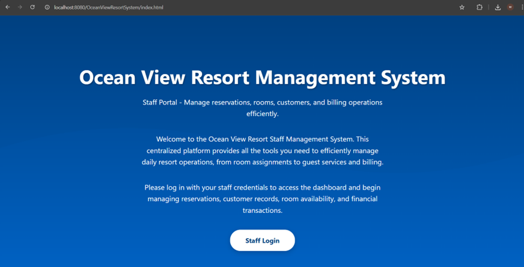
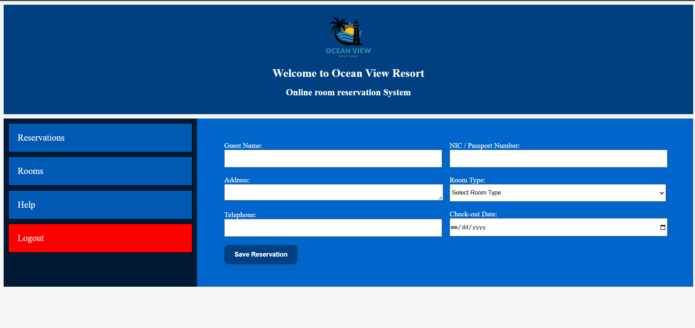
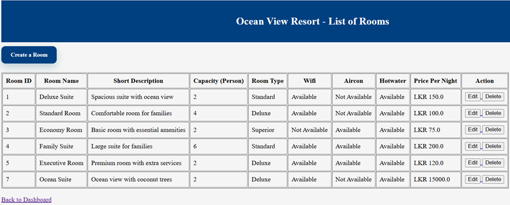
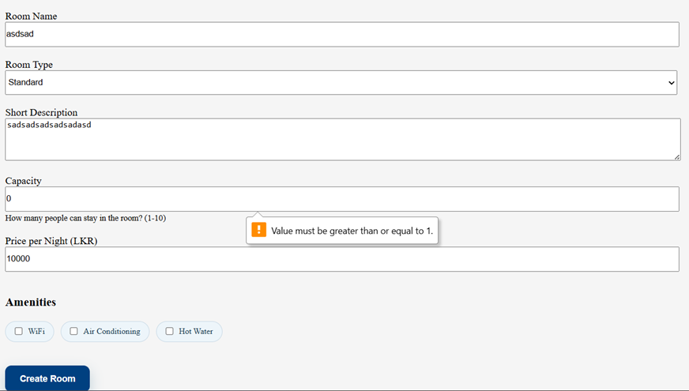
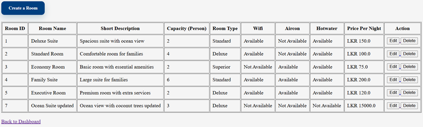
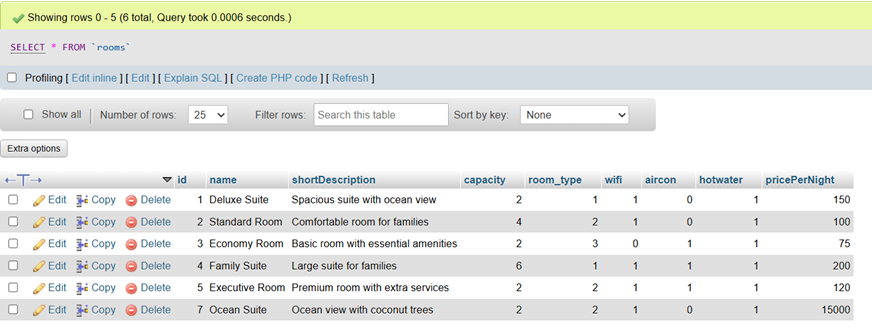

<div align="center">
  

  <h1>OceanView Resort Management System</h1>
  <p><strong>Advanced Programming Coursework Project</strong></p>
  <p>Java Servlet, JSP, JDBC, MySQL, Maven, Tomcat</p>

  <p>
    
    
    
    
    
  </p>

  <p>
    A full-stack web application built to manage rooms, reservations, billing, and staff operations for a resort environment.
  </p>
</div>

---

##  Project Overview

The **OceanView Resort Management System** is a web-based application developed for an **Advanced Programming** module. The project focuses on improving the day-to-day management of a resort by digitizing the major operational activities of the business.

The system allows staff to:

- manage rooms and amenities
- create, view, and complete reservations
- generate professional bills for guests
- handle staff login securely
- maintain data in a structured relational database

This project demonstrates practical application of:

- Object-Oriented Programming
- MVC-based web development
- DAO pattern for database operations
- session handling and access control
- full CRUD operations
- database-driven application design

---

##  Key Features

<table>
  <tr>
    <th align="left">Module</th>
    <th align="left">Description</th>
  </tr>
  <tr>
    <td><strong>Authentication</strong></td>
    <td>Secure login page for authorized staff access.</td>
  </tr>
  <tr>
    <td><strong>Dashboard</strong></td>
    <td>Central navigation area to access all major functions of the system.</td>
  </tr>
  <tr>
    <td><strong>Room Management</strong></td>
    <td>Add, view, edit, and delete room details including amenities and prices.</td>
  </tr>
  <tr>
    <td><strong>Reservation Management</strong></td>
    <td>Create reservations, manage guest details, and update booking status.</td>
  </tr>
  <tr>
    <td><strong>Billing</strong></td>
    <td>Generate invoices automatically using reservation and room details.</td>
  </tr>
  <tr>
    <td><strong>Database Integration</strong></td>
    <td>Store and retrieve system data through MySQL using JDBC.</td>
  </tr>
</table>

---

##  Tech Stack

<div align="center">
  <table>
    <tr>
      <th>Layer</th>
      <th>Technology</th>
    </tr>
    <tr>
      <td>Frontend</td>
      <td>JSP, HTML, CSS</td>
    </tr>
    <tr>
      <td>Backend</td>
      <td>Java Servlets</td>
    </tr>
    <tr>
      <td>Database</td>
      <td>MySQL</td>
    </tr>
    <tr>
      <td>Connectivity</td>
      <td>JDBC</td>
    </tr>
    <tr>
      <td>Build Tool</td>
      <td>Maven</td>
    </tr>
    <tr>
      <td>Deployment Server</td>
      <td>Apache Tomcat</td>
    </tr>
  </table>
</div>

---

##  System Design

This application follows a structured software design approach using:

### MVC Architecture
- **Model**: Java classes representing entities such as rooms, reservations, users, and bills
- **View**: JSP pages used for interface rendering
- **Controller**: Servlets used to process requests and control application flow

### DAO Pattern
Used to separate business logic from direct database operations, making the system cleaner, maintainable, and easier to extend.

### Three-Tier Structure
- **Presentation Layer**: user interface pages
- **Business Layer**: servlets and processing logic
- **Data Layer**: database and data access classes

---

##  Application Preview

<div align="center">
  
  <p><em>Landing page of the OceanView Resort Management System</em></p>
</div>

---

##  Screenshots

### 1. Login and Access Control

<div align="center">
  
  <p><em>Staff login interface used to access the system securely.</em></p>
</div>

---

### 2. Dashboard

<div align="center">
  
  <p><em>Main dashboard that provides quick access to the core modules.</em></p>
</div>

<div align="center">
  
  <p><em>Dashboard layout showing navigation and shortcut actions.</em></p>
</div>

---

### 3. Room Management

<div align="center">
  
  <p><em>Room list with key information such as room type, capacity, price, and amenities.</em></p>
</div>

<div align="center">
  
  <p><em>Another view of the room management table used for administration tasks.</em></p>
</div>

<div align="center">
  
  <p><em>Form used to create and register a new room in the system.</em></p>
</div>

<div align="center">
  
  <p><em>Detailed room creation form with room type, price, description, and amenities.</em></p>
</div>

<div align="center">
  
  <p><em>Room editing screen used to update existing room information.</em></p>
</div>

<div align="center">
  
  <p><em>Room deletion workflow from the management interface.</em></p>
</div>

---

### 4. Reservation Management

<div align="center">
  
  <p><em>Reservation management screen showing ongoing bookings and guest information.</em></p>
</div>

---

### 5. Billing and Invoice Generation

<div align="center">
  
  <p><em>Automatically generated bill based on reservation details.</em></p>
</div>

<div align="center">
  
  <p><em>Completed invoice view with payment status clearly displayed.</em></p>
</div>

---

### 6. Database Evidence

<div align="center">
  
  <p><em>Database table structure used to store core system data.</em></p>
</div>

<div align="center">
  
  <p><em>Stored reservation data inside the database.</em></p>
</div>

<div align="center">
  
  <p><em>Stored room data inside the database.</em></p>
</div>

<div align="center">
  
  <p><em>Additional database or query-level evidence from development and testing.</em></p>
</div>

---

##  Functional Highlights

### Authentication
- login validation for staff users
- controlled access to internal pages
- session-based protection

### Room Management
- add new room records
- edit room details
- remove existing room records
- manage amenities and pricing

### Reservation Handling
- create guest reservations
- record check-in and check-out dates
- track active and completed bookings
- maintain booking status

### Billing
- generate bills from reservation data
- calculate stay cost based on selected room
- present printable invoice output

### Database Operations
- perform create, read, update, and delete actions
- connect application logic with persistent storage
- organize data efficiently using relational tables

---

##  How to Run the Project

### 1. Clone the repository
```bash
git clone https://github.com/your-username/your-repository-name.git
cd your-repository-name
```

### 2. Create the database
Create a MySQL database for the project.

```sql
CREATE DATABASE oceanview;
```

Then import your SQL file into the database.

### 3. Configure database connection
Update your JDBC connection settings in the project source code.

```java
String url = "jdbc:mysql://localhost:3306/oceanview";
String username = "root";
String password = "your_password";
```

### 4. Build the project
```bash
mvn clean install
```

### 5. Deploy the WAR file
Deploy the generated WAR file to **Apache Tomcat**.

### 6. Run in browser
```bash
http://localhost:8080/your-project-name/
```

---

##  Suggested Project Structure

```text
project-root/
├── src/
│   ├── main/
│   │   ├── java/
│   │   │   ├── controller/
│   │   │   ├── dao/
│   │   │   ├── model/
│   │   │   └── util/
│   │   └── webapp/
│   │       ├── css/
│   │       ├── images/
│   │       ├── WEB-INF/
│   │       └── *.jsp
├── docs/
│   └── screenshots/
├── pom.xml
├── README.md
└── database.sql
```

---

##  Testing and Validation

This system was tested through interface-level execution and database verification.

### Evidence included in this README
- interface screenshots
- database table screenshots
- billing output screenshots
- reservation record screenshots

### Typical validation covered
- login functionality
- room creation and editing
- reservation creation and viewing
- invoice generation
- data storage verification in MySQL

---

##  Future Improvements

- add role-based user permissions
- improve frontend styling with Bootstrap or a modern CSS framework
- add search and filtering for reservations and rooms
- generate PDF invoices automatically
- add reporting dashboard with occupancy statistics
- introduce password encryption and stronger authentication handling

---

##  Author

<div align="center">
  <strong>Naveen Pramodya Jayawardana</strong><br/>
  Advanced Programming Coursework Project<br/>
  Cardiff Metropolitan University
</div>

---

##  Final Note

This repository presents not only the source code of the system, but also the design, user interface, database evidence, and implementation quality of the project. The README is structured to make the project easy to understand for lecturers, assessors, and recruiters reviewing the work.

<div align="center">
  <br/>
  <strong>If you are submitting this for coursework, make sure your screenshot paths and repository link match your actual project.</strong>
</div>
