<div align="center">
  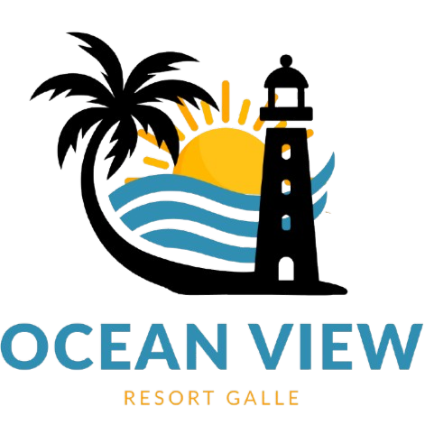

  <h1>OceanView Resort Management System</h1>
  <p><strong>Advanced Programming Coursework Project</strong></p>
  <p>Java Servlet, JSP, JDBC, MySQL, Maven, Tomcat</p>

  <p>
    
    <img src="data:image/png;base64,iVBORw0KGgoAAAANSUhEUgAAAVcAAACTCAMAAAAN4ao8AAAA1VBMVEX+/v7////9/f0AYYrkjgAAW4bjiwDihwAAXogAWIQAYYnjjgAAV4T12LDihgAAVIJym7PmlgAAaZHww4Y3fp/yypL9+O7mmCn45MmuxNGIqr7006HrsWTE2uT22rabusr67drrrVvppjy70NtXh6Ta5+znnzbsslfx9/nh7fLb4uiVuMrp8vUrdJdfla/45MvuuW388+XvvXg2epznmhyKq7+yxtNUj6tumbKjwtF5przA093P4uoab5VDhqUATH3z0qfuuWHzz5jrq0vuuHPxxYTllSmvHU4OAAAgAElEQVR4nM1dC2PTuLLWyHViN2kDoXTbQqCQDZuevigU2qZp2EvPnv//k671Gs3o4Tilu+cIAhl9kmx9Go1Gkq0I0EGov0Ko/5oghQ3SCVL9ab5JiQJGuD+mAJcVRCaiA8qvnYxIClLXYHY/ncwBIIW2512DYt0FJSKDggu0hhJocUC4E0KKjAgRYVQA6Iz+SoDJ13FZVg9fT5ekTr8eCJdeiCJIO3heHeE2i8SP584IIiHopiAqD5QmWz+g/zA0xegG+uoj4K6sqqIoqqouV9/nkc7m87ZdF2x9ZcgEi+Ao1VfAkmkPN99sNFH9QHE5OxGHXD1FKumv6yucjKuiavR1W3Fb702fSWWdGWSdXbCIEE3y6onnjdJiBQS4P2D+FezPJqgktSGqI0WgRjEKi7oob0+//T4stdaOVjPomrcFTbIRaywTI/vqeJf+g00jBRHcBVEw3JiQ0lcQ7irrURMpA/XO2mebFB6q8rapi5wtHoaK2bI4VaWygjJ529CAG05UGk3oayZITwm9AVJQRgk3FZ8eYFyUd6Dv5eTuodTGYDGPFecfCIRXS5wdriQZu7yqdxi3sGSRaIWObpcOrHvKLiKMq/K9rokEmN8VdcNsvbo7XJ6dzT21nYpiN+FGJkcIdnwiBGhsBwilMa/Jkcvw63QOuApCi4JCq76mathef7goq3NdFcPskTKzVV3Xw+FwvPi+dPVsK1lyNLhq9+D9I/A11XHaMhkRzaZJTdynoOMmlTREoR3V1yWCN1JciFGY1sXwkOSdjMtiu1DeQWNr6+3zxXLevWRyE7bqNDItYFLLnivZtagfT8wncv7y3mArs+tRrsfuVkhEgLJeMN+rivHMlaAmX3v1sK6NU7tdVeVQ+V4AqbxYcozaRsDGYEIa9XaVBMHyoZKCazyqtU743wiTYVHuSRIhDw/fHy1We80srBnHtotqeDPbvFhHN9CmcATGgqVGqxy4jAC+ECu0az22LTjjwW4B6FW7oAFG9DeRM0QXZVG+wEqQ9p7f3Za1mjCU5ZHMlwyZknP9P09N+q6Rp0AXQ8qJkO4taLooKhIouUFqgaBdCCK0JTC+FkN1ODs9Hypm66+T6DLxNSN046BXVnx1hafFmZrsdUgEs7wtKxKtSX2p7BIiGxGicDZujOkJpJI2zN491MpFqBZz6H6Z9S0qkqi9KO33rO9DxyCY+gH90oaKGCV2QaBiA+1oEYqKOa2Kam+eQHXx89Oxmi/U50vaZTBppuTNbAAyC4zYBGFA2wtoE3k7/dQbYBZgg1bMhqNhUR/l4bOFmuJW5ekGRaKRpX+4EKNMYTPmpKPmg2WG5oHgWwe0vdOtQUGuGo2dkHbT9cIUjdNwriZi5c0ZbFRyQsitLPDy3B1QTSI6CsDHMoczDX6GQLpHUDiLyKOzcVGuvPj+9mLCVWm+UFa2PJ+R4au15HjsZkKMqlx2eoq63RqeOKvbLHALEkWsQ+GwLsopRpz+KIfvgSYFOFRWtqq+Q3vJGAtC0hQyzJJAcaVAhC4P9pxuZNAvYV/nKH6jHcIn5QNY5Ih1QFdVdeO1SWnnLEh+sqdtwXsyTreWrFZSJE1KhQg1lbHzAoEFAV7Nf7FERJx7IeQpK7SjhPtACJopTootdl8XoxOnEcqnrd/T9tS24EKvdh2FXRQSN+EWmKXRRrLiTAXmNZrs2n91luC/HJAO33i0SbqgMD+v6m9YEEzr4V2YF8SRInY0xSEjX3JoGNynHdW1ad2j6hJkyhCkItajv14S3JTKh0UNPx9OIMwLcDdUu2Fm/WtNyRGXzG+BCLXLqGb1kpSWoTNZEwpBIh10R2mfJ9fJiZBFT+tiOPPq9/0FeAHVEg7VOleFu4uQKZl7qkJ0Ecm4FSpxuvWySmL7nP9wb19AV5SVHF0mj1LxpDCGwIpSxtqn/rsvlL81AY7EJdP77Ta74XuzrpbBRegeYrSp6HcXBZvkr1urXbeSu57IFhQuquoraaRMXrUQXlTjWdiasRYxhYu0L0JpcRCNW9HNtwRv7sNuQztYiEKMhvcddaNQ4DWz5dyVVbEkbj9Hfd7vQ0XsSea6Li9nUKSEMMKZWD9fiJuiU0gvX4VCB/Q5ApwVzLfKpoOLhthyNW9P+oTWFnanEJ1WXhrlFZVD8PwYIb2LnIgIUMiiG80Yc+iLxiPokne+amZe9QIgiTpFo5ME7Gs0IkRNkN6uPtUOcC3nucM+sB418aQhgfzbBYVpQ9cS1ueF2bjaLpR/6++KGebQXOaEZIRfH/gfCH4e6RggCteKCuFTjavyiCAB6vPCRD90NIMkKoL5WDuVISr9PBaAJ+vOdHSFhG52QwkNWD8mtKPmy/vGcM67FKSc3aIyu42Zy7hYMuBhBKRQ4R65koFl6MhYjOqZMume7PmmbmjgUBgdImI39OxBubCteV0BF43NKBeQRFEAfWvWYloBHBshiqxKX5TnajN9faZAHk9Cf5Y9X9cRbdRQOVAd8sLJuNDTg0zJa+83FYzW+CH86WEDk97eAYjTAlSIItrR+UNRXgB0yTtVXuzXeQYFtqWJS1fuujlU+nms9yqo+WPCOuOYCu0JMk3g7BaNhk1QZTfVAiukUCo0aW+Us3WaTIrX4cZWZNuU3RaOe7SW9ntjOaR0q49GcKuPPoJeIhSiiHb0edS1cU2/NgP9tEteOFHPdCqfIIk+cbbC7KuN8XbDP49JgNSkPlLdSOiGJvnKkNeOTtSDWctOlkD5BMpqJFF7a35XAO1DFmXrLjY9Lo0T5kNO6SszvDkZX1HojoK/iKBX3ACF06ooG7OZSBpEGN1WbeBQQZOLsJaRBkcoFoFtnwyGP6CaGwjPF0L/xouxK5RFjcKdlkU9gxxKI+5H226YC1F7JceRIF+cwPTcxLpnjLGkX+AjcWXhWrw72tLNN0Vnw6KaQZe8clUWVXkWE0Ruj/DjIkQOJfpqWyq+cFdSLU3OXzbxkhr+DqigPklmtSOvdhxVqy+reae8ekFBuwQJNDSCVIgiSKyfbwkIkousICkQGJz2EXTd+GpVhOkZsIhuqLKazTyqW145LuyDXRHqhyZze2zwkWkUaE0ExHcJFAzqHvxni/SDghNgI9TdcHg93rKpuwlQWFbFaBnbtmRe+NYo7NCOXAwFkipzyUSvljgv8CTyOiRXn2lESltTnlhXlPrYZO1DELPQDZ0Oq3OZQiGRd1IZVytCuQp1ZBasHQA0v5KYYPtF+rl10szgdNr3oHC+twGKsaTnPg1dlOVpFg0KAtiryNyAoraLef9T0nvOodR/zQSimOQZj4hovBGggg+dUBLBiA8D0P+jKZFRtLF5xDiJRnn1KoHaxQ1RyNS37X1uPy/IabvAtMRe+wiRGYY2dKPjaidVciMUZlX1ELg42bxg5gbVwxlkkqYjM6incXPntTX1ZkXxnOgSubsKhK7oXa1WYDvnhTulsHcQohBw1s6oqzrOC3zqmJoOfSDRq5nQEWUz8GQVOqPwra4P2/PygozCQoTKUJBMSKPrQxsjWEbecW4Z75Lomsp351hcVOX9JnkbBW9crWlckLtV+hK/8ASmUf2/ZPqeCUkPaZ2Tv3GgBgnCiE3Q+Tl9NiNEXW9naFHpnS6OJjo5CkCFgD32vDa54yg8O4WZEFfEVSJtyxKoqst8XJ3PgaFCpAuyEXq5sJ7GBlWIgJOIoCTq11+9Yrc4ESlUCLfA6JWYbBhtgCZaPhK6oDAvFa+BgmbyGhbhTE1mVzKg0vdRoMoFYQ9mKH0OXrBxKywaCeXXEqEi+yJSDuh6lC7VCzJkOz3sip5Vjlf9mXTIq04yKep7YKhTde/522YgEQwNKoSan6bhnwyR8W437UnB8OoiYKqnUmvywkxtyOzxG3l6Jfg+TNTho1v428YsEwILmhobOqBWX60wG48OIZE30GDzLMEUOApUT4HqqY8IBH8vuNqQrCckhWTELwfimbsHcXxEZxTmzXTrxM63Gte02oP1eWFZF9vVOVDU/UPXacjqTQoVkX3NVFUK3EBEVfUa+7x6a5Uq95JUVxTmTZ+27x2afcFlLi/5yN+rohhNIEDZOhTTe8ig2JEc34J4+55o1oNEjAY9jNyM60ud0Whdn+4IrEfxq3orxr7ucqYfeH8RbXIl8t6PGgt7wy/ztGDWCTP+gElBD8iRmMdF0IVCWmx0nU5o0PRoq5KK0YouyvrOVGo63G66d3EGHfKem3cOPPpEXnHfUERa9EyhvaQQxTsAejuoYRugp6V6mk3xelNum7fghOCbK3FevdFVriRBUx2VulSpbkzi/FdJs2SNJzwn9xgkak5kV5ihi1EI0Ga6r9YJFQl7SgerQi8Crsur1rf1DqIvLLKeYbtGKBm30L5GIWlS44gECwlhHWr6px1pg6eJRSsa5T2r7PPCSzXvv3gohu8hnxe/LPWxUKvp3KFxu+aXXRF1pKzr+ma9BsIIFFjSIHJDlDs0UTUYmkrqIuChKPXO9f2wKIaTb6VW2Pa8ippm0rVdVPX56Un4pPUmQfpxi5XCicYBigxf/mQ0Rzj2kaCQDVBfx9gKUgY6oOoR2K/Krqi3iepZo756m2VtXnlR6/M462Ix8x591Gvz3Zi3BOpzPNHrHlKrMyA3QYHfdCBsgjaz0mqklgXURsD5mdLDap5RHM7t9Gakzzotyxs8uwjYBjh9usSgCSrc/pZzLtxVXY7MkYRSUMQTRSnkr493QNkRCeSWqNAZvanUyA63pXZJGy/WOAgZe4J5QR1ddFuog2DK4e0ZMktpSbQMQ72jJp5sSmx4FvdV3wZxMtk0QPfbDdDJsFBbMXvVdqUewlTn7i475TXUrqpGacuHO8sRN2D4f9K8CTcvoHYgxxqftaK6PmsIdofY3bZYNYY6/VLLKFUxhbF+L0PAyUNV3tD3RlheFm1onqhjoaraH7GzSUXIPndg0p8cnqq50twDvgLkP3mhFT0ZV1X5UJh9VoDDodq/2qRkfdhp+TAl3TqgCPgHIuJYW/PKRkssMkTtV38B6QuFjVDzH3gDSPrp5ui9Oryh4XWoPSw4HVXNAJbJC4mSAWa/N8PdcGEtB0kBEh9OcAKipkr5eYEbV9ClkuSP+c+ZAxn8yQvt6LMGgLtKHT00XBjdaoawerFZTwR52rRMuTqL2WkPEthz8P/9EHWvsK9tgDY28mtVFQu7fQ7zVT2ih5J0KLmZrz2UjS1YbsAOWgM/nSNd1DtG0TZBFEHLEt5Ss4gcCjEqeN7ULXdBdec9mTivtRHnq+H5nA0mLXkdN+oks0qfCkWSsPGPCY4VNm4FU4KARImdv73rto9c+aRhgKzQHQXKB8xvf7xINEe+ZK1x0/O6qBf82ViZy+FgiefqptA2JfWCEUGSV2WcACJGhWBJCWo7LP0Aj/hFVL4YTWGjvLo5jqqqvpWYao31sArKz9HjDUFJhDS9pImAKrB+Q9QL3VDwlgJCIYqIUViHNl6BfS2+a179DabjarRwYz7y6Ow4jTAkkufeor5hI7o9mPGsIdqMj9/9Dm82h8ZmdLrnTh6JjSzNa5TTBfVY/SnkOOJlscjwGjxsYDJ/KcQ9DaII2AQVIdo4pRfzLErzKjpn94fvF6vV1/O97aIqunsFfN0lnYJ8YUMVmTCYt2hZJjJ76I4m7JxoEZ6GwnIxhzV5VbL5cvH1oR7WZVmpUBSjh/lacwxYRYHzAsDtbNfD49810ZEsgsy4cl5YZ/SfCQ2xayf9MDvaG5ofP1AnHNcNu+PTexncZiR4MnC48AoLicRpw2o/eWsXRbSjJC6wXgnh6SjM76A9Lxz+0OvbReO6lsVqcXQ6nbtdrxbbbj46ToI/0j/ORkO2cSKD2Gb/2lD8j3YxLlBUPBmFdXlhWWpNHRY3i+Xc/C6SAHq3djjyAkHRvroICaxq3bzXZwxJdUhr3t+MwkXZjFTnkxOjcq5j0qqz5wk9amPML/JRM7Au/H2GUHINTgn/GLocFu4ZjafUBOcFwnYM/s59uFki6TmP0qPPFNDzDtx0+ocLfxsKp+rgl2LKh/oO/gahB+ykI1FRGzoRAiQ1MT4OZRFpdGNefwVdw6u4UWdrFae+J7ezQFEc1IGTjaTOT5aT+8lMrT/m512YXCVezs7WtEMbyAlfH1jy9gy5pKmG1tKZOr6wqldLIK3OC6ERRKB2IK6tcqBX1VD95Nq5cviIU5s4/hVgcjseDRs/+uH2Tj7RLDGlacL+8c7rtnAMLDmIq4M3ibBzvI8juk3805bw050uHiir+ufsRv/WQbGYp+gJbpsHOy9wPYJ5T8vzUWn84sYxru4graw4Fl5g6nJYvQ+eh8nPAgKUjB4Hr1/u7vbbwu6fJPn+O5U+nWF3d+vtn8fERMHAItf7aBK4wmrb+E2fFl0XU2cp6QSLRFDB1kr6J92YksFS/5AdhpJS5QjBrw2tQ5+2qIZHrnzyNr0kEWkUmx/g3cetfm9Lh8FWJvR3XNeD/dfXPZeeBszb6w8+HLgaArw0aXu/7QO9rmACwP1DrdXq1v0IEjOWQPNQVKJ11f+wOt6UBQvl0rapTcHHoFNKa9MeozN2v0CvD2EFgm7UROx/TpGU4bXJ8e66Q/re1hfc6A55ZRR5juHkVvfCeu8kuMk1Afy6tq+fks5GniSttubcg0wps+2Kt8Lw22b3YcuxQ8D+p/56Vi2v6u/PLq2gdPbR+kMBr9k5YZNysleX5hdlnAWQ4PZjSYS3DybYcctM7ryxg+XIseo+o5lTadp/tfaq38ALtPvFk0YuM2TA577uwIPmn15LcPZ1p98bNBkGOk8qoStsq//BUqB4HRhecbYsCDne6jbG4KZhthpPwhq11JCsawd5JqivFaMqPhi7Ufg56nac2A9KkRBG2BuBg57XsN8+vM2GxmDqLL/1iEq+/BCFl16d++88r05fuUWjH8M4yOVFM3I/LAGcBXVt4SNQKYSpt2QW1tcNeX1YOadAHf3JxhqnuOoMMEvnoqK85ho2YcnsV/3ni7MCvT8u99c4sM1nxxuN3seDqzjR1buPWOIHo4ycVzKNEFyw9wXLi7I+72pjcTR1PYA028QNRA9TR9rwLl2ufnvaUH++HCKvZHlHcD1o15DGCeqZYbz3SDx3w6HTLjRdzecV8tp7neP/i+JRdfzrK6KvA20HRFB5VzIOsVqePoz28CicnD129dUK5z1mwlWjr3rAqsbgWUstvjZm4Ltrg/Lbv0ae17AJc1oa8gyu1zadlvQzwJGbC/K61xhPZV57nyFCXd5PttD+sa5uw+tgi/sDLZfRdzW//XEjwnlbqgKC21eg8wKvr2P9aK4ha0rPmcUhTq7QGTgjvOoUkFi39UKIGpWUVre2di+9wx154M4KgHzp2qFJH6Io/GmVevdARxA7ECbleakW3w0v/PnPLb0Oz8+yFaI1dLxWY4ndvFz59qATs9r9DvYCFK/bftyKW2HN8q3OhTwdQEIdIt24dul7x5BTJXineR3YMuHlFvoD+ZK5eWwSLh/ceabgPyKKoL/DF9YPx62xBP1zVdrCzqKEQuj3dU0bLIHrq1ExN8T4OwZBBTYKqY6NduASyP2C4IKrjXhJeI1QG2F5TeprkJTmpfMZfabpyoxdeM46QwMa6YKEM7SM17kf7mNe/ZygUeeAV6XM7234TrNSNYX7bzZ8t/dMeI2bMbo+19dcKsKryM1jO1xs3nWvW/rNF9oFtB3Ytrxqt18J/ueEyaVQm9XqOuHVjGmHP2odRr+nn5dphs2jkU1ya1SW8UocAOGb3Siv0WHGa4i6vK36minZ5jW1dLUFFhGg5Jt/zwjooTpk3JLqlK+GV/86JPNd57jopV6T+NfIznrdz4l9t6xXv/OLk4H2yHSHbfdysCT+ADUEIhJMcsZrgGKHzutrsuTkxIvqH2ltjgo2bjnPEGtL7YAAtwhT2eccfUfWr6HrMPreGBlmByTxwSqvr5Ie9tIIlledR98K8vQYuJKB2hoh0NcwqY2gvEI437LXzeRFNiMnK40CXddm2mzswLbndeI8KXPEFElnTqd2lMf2leor3g1TWsqriXhpJvTcz/fuD81reB1QXhmK11S8DkJ9xXlByGDYp6II2YZapRU0AdFXs5A11pOMPcfeHht+zHlehhV1fCWE8wLD63ZsB7ygeXW+mb6/Py0Hg0Zj310e77OAzoX7aH0dhONWwEvkZ/USflbi/tIzISHCQYIiguqr0yP3tNZkaNS18V9V3CGur06AlCUEmROoEzzouCX1XMzra+K3zHQSN/BZOyBg/6Ofmfa3Xn5i4fHDZ70GgN1XvmT+gLONWCtjKNm4Fa4PEG2N8wpvSFmLEbUOUPfeBQ6BJBOxA4J2d74A6Ic3/TO3gR1Qf4l9JfadVoLZARNz9Rtdfw1X/fq7g7fvyFO+6XFL0IEoHre2uo1b+Mq1HQuE+0EML4SoCOYFvCsQf0Anxw2BoRq5nOrhgKbPXhepcYvoK5BNH4PqNgvsq2Lh6sNuaqXa7ao05H48wGnEL88LWPKUgKogU4KOkCLzYC6gPWF+lrYDTQPNx04xvwE+Tah+cc1ycmEOIm4dtwijZGbA/AHhFPngsd+6CdDr/WULlNcYR+xrMIpwfRVEX0UiAGZPzsRFMoKj1n817UPWlpm+qohvztV68FtX+ow0w4l5gWe9P8AqbZo68LOcAlx++e1lvyGXB89s/4v1swJ9DYyeFUJek+uvqbxPCN5/Fc5yY8UNr9uWV/VLVfZh0EIfSGMmU3Ok9cbS2ElfeeD2Fc2bCsc7b17/8ZEMWteNi+CJfdM2L+BGc+28IG1jQ+/ZWwdvLkLU9Uf+u2aS8artgGXILa9UuKoF73FOcK+zc/uqDCqOW+XvEByzL+1b/SGvxGjR1Rjz//7BF9TZ3qd9ra/BvIBWGIU1vIoguReeFuw45ogmSjSxE1LjZ6lEy6qwfqZ1tWD+UNlEX92hdYxXEfoD7l55LaJ5QVBHOr43LBwM3ADWP9b6kOQ14KeN16gZ1kesTS7s7Tp9tZ5XQl8l7Ln6XxjN1j/FbEyD+x3ctB3Y7mwHMI4l4DYKXuP67HGkr7m8ndazIM77tMDPd2GjCVsfMNH3td3x3taLZfr3aqyPO8/yekf0NR34uMUNVsK+NRRteV5D+xok9QWx9QFB57G5yxBSgm4ECf2kAju3PNwvGBF9taOUm8ya32tX+wSWEPMLDBLt67azA9LOc7eN/6q3XqSgbyM6XredHfDzHxDki5sBKVfUzXJ3NY9sHkvtMp3x0nks91/RUiSva50n/Clm26HZwlEU4cetyEaz9Vc3/KPu1ToHLnIV6HnRdUKrrxv5A0K4SgY3RXqT09dBzg7A/v/94cJf0k5I8/OCxGWIPbJkw8Ff19cf/7xCL1CQeYETJL1PWiJZvGPrWXYxQI1TOgzvGuWbFU5dFzgkxfNYZgeY/cS2oOsDERo3emAHUvtblwPn9vbfGgOKvPZb5gWBdfWMwNXb3evHPz71B3+aoUW4aStbhKEL2FpfJTaDU97YvurnL5zyqR9VOqrt44bVElzR8X4B0df0UlDoZ4VTRxfhTRvlVSCvA7OHbVId4wNe/UezSJMZt66vgF+GNqXtqOp5sd5P5ZAdf9z9CUEFqGAbhu/HCmwKIcL5lmXgDB/RmIDE3e8bP3Amxq3QDsRKEfmvwD+hwHml+9wHzrcnS2KaOgFvHK+XlNetLcwSXpfEwtveu59Nu13/3H/sH7hBgM8jBH5BCxsZMyECfcVNFzdvbbjEfYIh2Upr5TVjYBPrLnx4ZUJTm5/czxKf0A48+rz7b+1AtdV7qaZhzlgYn7dhyqBqzsa7RyzA8e4XePXx+Pj17sFV73N4eynf1fRVXPTxjcX8AbTJ6hQ1y+b0K9nWinjd9v7r0D2SSN/ZoRQ3vJoUXZ5BVJ1x4HgcmHGKPEf0Bq8B8t+osYNLeOXyvDR5fvatC3F96R0hIOOW0UHTrK+bBnz1Vm1ovobPg31H3PqbDb2ByA5g9E1ll7vNsxqNMKQb2PF8C1e8qvFUQjJ8C+dbLUFevUZa9TNsakhyz8c0UW+P/UX+woSDR+TYqvQBLjlu/XW5z1+bEHTVXSX+sivh1W+vXj32r+DVboedcTovCJxguh8rvGHGaNwmGNOFstgOwBHuNJTjxen7RNjzS+b6HuSrbPh8vdXruWXY/o7tgtd+LabXu36LqQfO0fWLNabfN9f5gI3RFHj96WMmPKrh6kt/X/E6eGx0+9XuVTRCcIH6r2gnIn3FeYFlbhU8mF2fsmwhrwLmNzUmLutU4M/MCrHvXrfo2Q8Gvk74l7vvdzS613N5E8u3vY9uFen4muXJhZdqPqZ0tLEDO4NmBPx3f1/Yc1PcKj0KblWZzQu4djv7uo3rr+ZjN7qsyWymUeOzdl4bYi+GQVtkgs0D+85v4m9ssIhBr/9vbxd/9nocTeVVTXGNnRgu/dPI+cv0rvf1uPUKXn0A+ekt7A8+oNvkJldCEEEyKp1T4ce1yQjnW2xQlvx9jqE7nANyvDYF343rLsxyXsPAKt9THjq5ws6gn0tKc30mtlG9xND2Ao3jVRnIx63j140xP+gffNl9t9a8gmB2wFoHS1B63GqAswffr6vRLTEwKftqqj2/W6lDVat2du26S4ZXUtne7uA1XY9WJH3Z6vfW5Ns64K6q2HkMTEvUIprXRmG3BvrRm6vH3c/rRy02L3AKi/OCH8PRsAmjSu8Teu7g5GZY65M5qmF5NOeXgX+ZbKPRLTMPIE/uLn7fG6/nVXHU+jbc7tbHtzv2qSrh7JtaFPj5Idy2Ma/E9d0I1ft4xff6QFy9efvhZa/lYgO9PguXn3av/3rzh9r7AX9dbCAXAa7fsudfBU1yNnVB0ueNtSs7Odo7Pz//uno/s1tiXg3mLteS2RXj+MxPZqnwIpgXyJ18eKee0zCbCK4i6HzD8eXOlz9I+I7tNboAAAKHSURBVPxm593B5aWf0346JjNld1tXx5cH77LXM6t9sP/n43/+85/Px8TqAaE3nFh5wnwSp2J0pY2mZ1DoHydzJcrM+K+ueVoDa3/6yYR9771eX8bLAOuvZsuWrFbJzVlPpWk5oFcKuE80h0uFAls2cxFMkJQMhvJ1wixrnMJNUJCfd6317A3ewSZ5uTETXYN/3gUnbWET4Hqtc8qMQCMsbZiFPxS2Hv0W7Me69TVc4AgiNkZB+DeXtnY2yZsyoLT/I0qtkkCPy1UUcA2fthzjuUXo+sgCjwBYVdS++itCeHnxRLRpLtwT6/XeQHSZtrzuH9Zl8/2G1A+c6acp+DJotNbDV4EEzYyCEOCKJX+4APqAZj3H2FYPLWfWBqOITVH1Cq17uus1QNe8hGJmLFHMoGbuRciGWCXREeBaF0Wkw5pRYT71L9iPwtPCEjfTGQ36RzN1wNc//9iB7nlJT2aqzYYhoNaNLo855jstf6VCqgPrz+TrXks4f6hw+la3vDD+DIHoXvdaRjZCJCISd83nW+FltTanjs8TmQgRCTAdVq3Bz90eTsggkOyov4jq7u8+G+QFYrvQYHqrFqJCuCNdfURL8A8BSid2aEO4D9+gz4R6vARhq87s739ZzOlku8Y6XoHwChGe2O6LUZEU2nnFc06q4cWZHWC85WL+joiEfwIlFg25SUbEgtNszvnmli59yfX6WlXlsHA/ceOqJHyFRVzhvxMVAQpR3aAtwpYRvx8beO4gwpOwfQSiMbk+YvpjOFSnP+l/3X9WUN+q8fnqcBYpRlTYP4zysGEBcXZCO4TpgQv0DoxqipSbe3LYFr5P70+kdyfpwAKB8HxomLQFjUoNS47R/we71toOju9dMAAAAABJRU5ErkJggg==" alt="MySQL" />
    
    
    
  </p>

  <p>
    A full-stack web application built to manage rooms, reservations, billing, and staff operations for a resort environment.
  </p>
</div>

---

##  Project Overview

The **OceanView Resort Management System** is a web-based application developed for an **Advanced Programming** module. The project focuses on improving the day-to-day management of a resort by digitizing the major operational activities of the business.

The system allows staff to:

- manage rooms and amenities
- create, view, and complete reservations
- generate professional bills for guests
- handle staff login securely
- maintain data in a structured relational database

This project demonstrates practical application of:

- Object-Oriented Programming
- MVC-based web development
- DAO pattern for database operations
- session handling and access control
- full CRUD operations
- database-driven application design

---

##  Key Features

<table>
  <tr>
    <th align="left">Module</th>
    <th align="left">Description</th>
  </tr>
  <tr>
    <td><strong>Authentication</strong></td>
    <td>Secure login page for authorized staff access.</td>
  </tr>
  <tr>
    <td><strong>Dashboard</strong></td>
    <td>Central navigation area to access all major functions of the system.</td>
  </tr>
  <tr>
    <td><strong>Room Management</strong></td>
    <td>Add, view, edit, and delete room details including amenities and prices.</td>
  </tr>
  <tr>
    <td><strong>Reservation Management</strong></td>
    <td>Create reservations, manage guest details, and update booking status.</td>
  </tr>
  <tr>
    <td><strong>Billing</strong></td>
    <td>Generate invoices automatically using reservation and room details.</td>
  </tr>
  <tr>
    <td><strong>Database Integration</strong></td>
    <td>Store and retrieve system data through MySQL using JDBC.</td>
  </tr>
</table>

---

##  Tech Stack

<div align="center">
  <table>
    <tr>
      <th>Layer</th>
      <th>Technology</th>
    </tr>
    <tr>
      <td>Frontend</td>
      <td>JSP, HTML, CSS</td>
    </tr>
    <tr>
      <td>Backend</td>
      <td>Java Servlets</td>
    </tr>
    <tr>
      <td>Database</td>
      <td>MySQL</td>
    </tr>
    <tr>
      <td>Connectivity</td>
      <td>JDBC</td>
    </tr>
    <tr>
      <td>Build Tool</td>
      <td>Maven</td>
    </tr>
    <tr>
      <td>Deployment Server</td>
      <td>Apache Tomcat</td>
    </tr>
  </table>
</div>

---

##  System Design

This application follows a structured software design approach using:

### MVC Architecture
- **Model**: Java classes representing entities such as rooms, reservations, users, and bills
- **View**: JSP pages used for interface rendering
- **Controller**: Servlets used to process requests and control application flow

### DAO Pattern
Used to separate business logic from direct database operations, making the system cleaner, maintainable, and easier to extend.

### Three-Tier Structure
- **Presentation Layer**: user interface pages
- **Business Layer**: servlets and processing logic
- **Data Layer**: database and data access classes

---

##  Application Preview

<div align="center">
  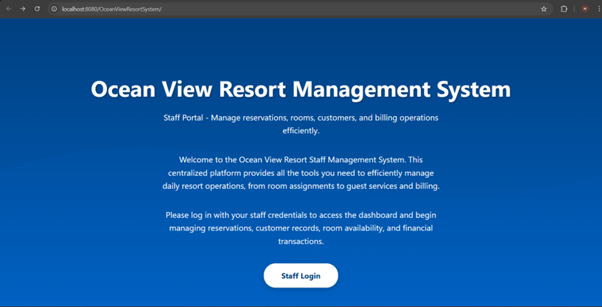
  <p><em>Landing page of the OceanView Resort Management System</em></p>
</div>

---

##  Screenshots

### 1. Login and Access Control

<div align="center">
  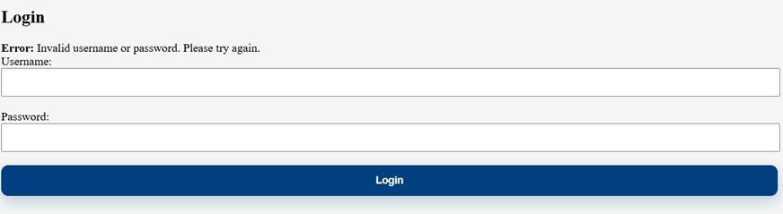
  <p><em>Staff login interface used to access the system securely.</em></p>
</div>

---

### 2. Dashboard


<div align="center">
  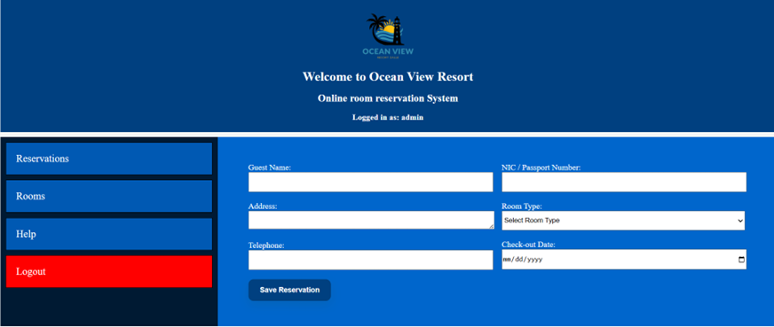
  <p><em>Dashboard layout showing navigation and shortcut actions.</em></p>
</div>

---

### 3. Room Management

<div align="center">
  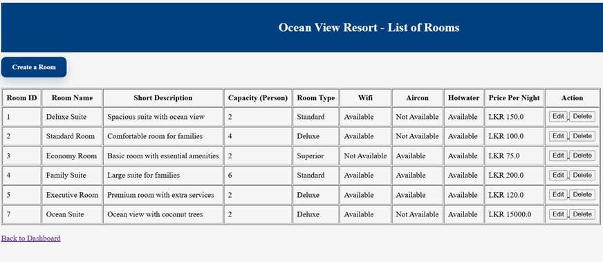
  <p><em>Room list with key information such as room type, capacity, price, and amenities.</em></p>
</div>


<div align="center">
  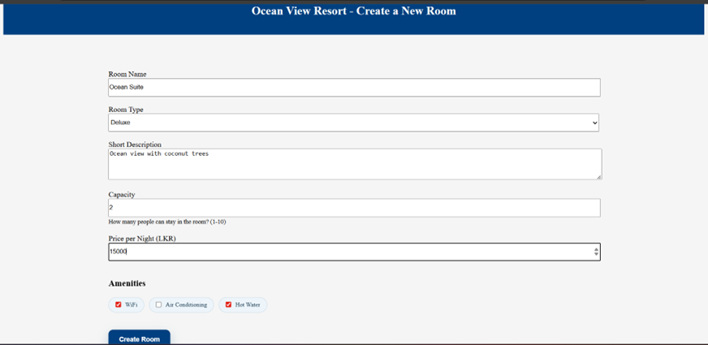
  <p><em>Form used to create and register a new room in the system.</em></p>
</div>

<div align="center">
  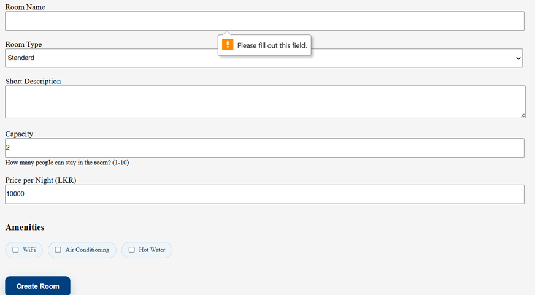
  <p><em>Detailed room creation form with room type, price, description, and amenities.</em></p>
</div>

<div align="center">
  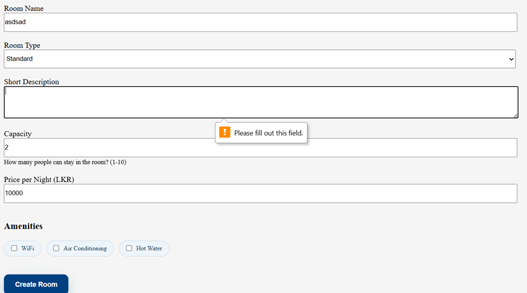
  <p><em>Room editing screen used to update existing room information.</em></p>
</div>


---

### 4. Reservation Management

<div align="center">
  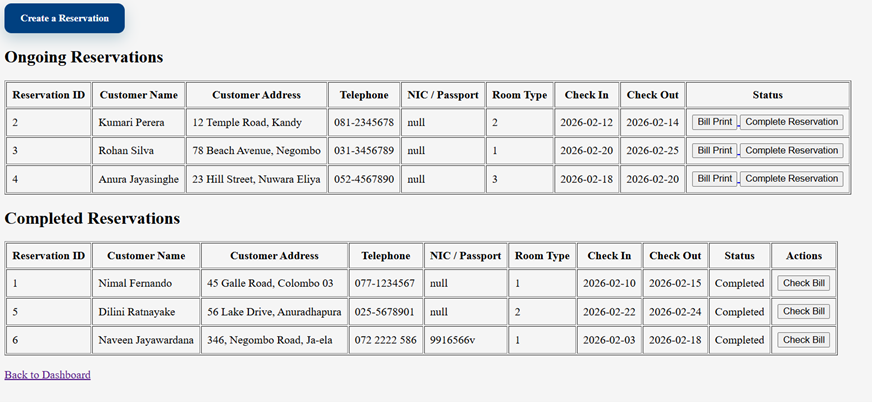
  <p><em>Reservation management screen showing ongoing bookings and guest information.</em></p>
</div>

---

### 5. Billing and Invoice Generation

<div align="center">
  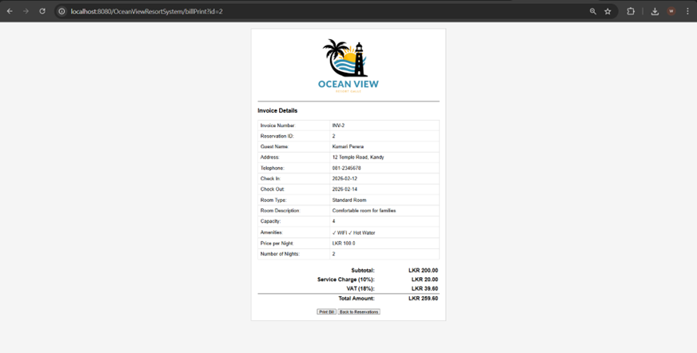
  <p><em>Automatically generated bill based on reservation details.</em></p>
</div>

<div align="center">
  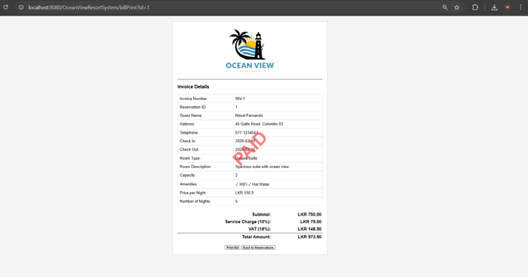
  <p><em>Completed invoice view with payment status clearly displayed.</em></p>
</div>

---

### 6. Database Evidence

<div align="center">
  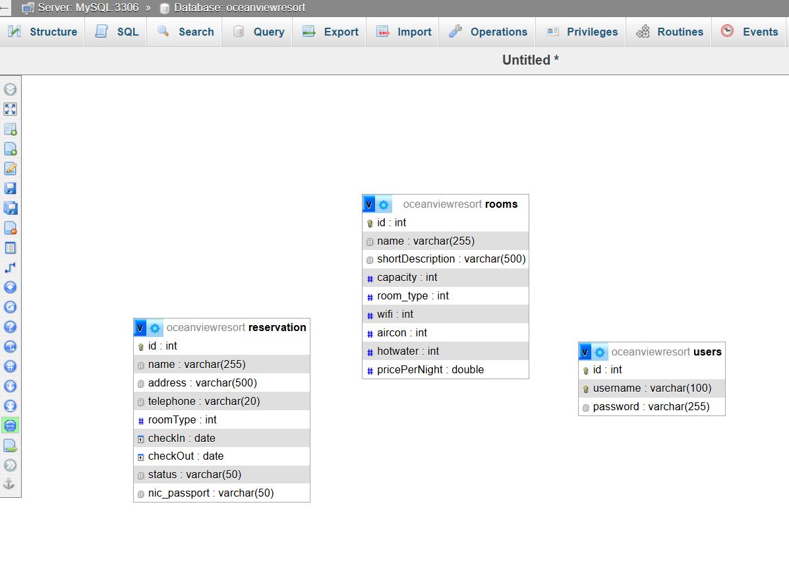
  <p><em>Database table structure used to store core system data.</em></p>
</div>

<div align="center">
  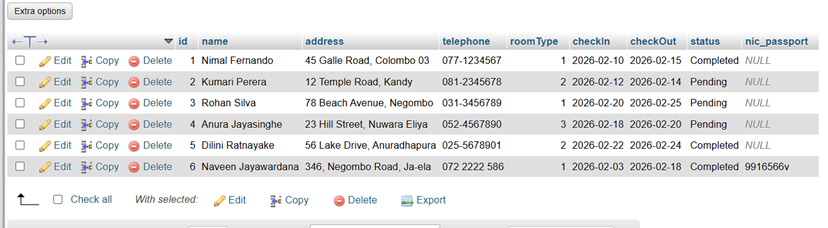
  <p><em>Stored reservation data inside the database.</em></p>
</div>

<div align="center">
  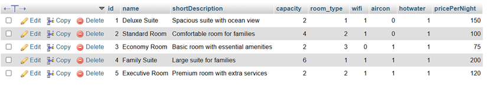
  <p><em>Stored room data inside the database.</em></p>
</div>

<div align="center">
  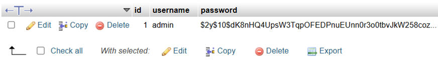
  <p><em>Staff login credientials and username</em></p>
</div>

---

##  Functional Highlights

### Authentication
- login validation for staff users
- controlled access to internal pages
- session-based protection

### Room Management
- add new room records
- edit room details
- remove existing room records
- manage amenities and pricing

### Reservation Handling
- create guest reservations
- record check-in and check-out dates
- track active and completed bookings
- maintain booking status

### Billing
- generate bills from reservation data
- calculate stay cost based on selected room
- present printable invoice output

### Database Operations
- perform create, read, update, and delete actions
- connect application logic with persistent storage
- organize data efficiently using relational tables

---

##  How to Run the Project

### 1. Clone the repository
```bash
git clone https://github.com/naveenjayawardanaleo/OceanViewRoomReservationSystem
cd your-repository-name
```

### 2. Create the database
Create a MySQL database for the project.

```sql
CREATE DATABASE oceanview;
```

Then import your SQL file into the database.

### 3. Configure database connection
Update your JDBC connection settings in the project source code.

```java
String url = "jdbc:mysql://localhost:3306/oceanview";
String username = "root";
String password = "your_password";
```

### 4. Build the project
```bash
mvn clean install
```

### 5. Deploy the WAR file
Deploy the generated WAR file to **Apache Tomcat**.

### 6. Run in browser
```bash
http://localhost:8080/your-project-name/
```

---

##  Suggested Project Structure

```text
project-root/
├── src/
│   ├── main/
│   │   ├── java/
│   │   │   ├── controller/
│   │   │   ├── dao/
│   │   │   ├── model/
│   │   │   └── util/
│   │   └── webapp/
│   │       ├── css/
│   │       ├── images/
│   │       ├── WEB-INF/
│   │       └── *.jsp
├── docs/
│   └── screenshots/
├── pom.xml
├── README.md
└── database.sql
```

---

##  Testing and Validation

This system was tested through interface-level execution and database verification.

### Evidence included in this README
- interface screenshots
- database table screenshots
- billing output screenshots
- reservation record screenshots

### Typical validation covered
- login functionality
- room creation and editing
- reservation creation and viewing
- invoice generation
- data storage verification in MySQL

---

##  Future Improvements

- add role-based user permissions
- improve frontend styling with Bootstrap or a modern CSS framework
- add search and filtering for reservations and rooms
- generate PDF invoices automatically
- add reporting dashboard with occupancy statistics
- introduce password encryption and stronger authentication handling

---

##  Author

<div align="center">
  <strong>Naveen Pramodya Jayawardana</strong><br/>
  Advanced Programming Coursework Project<br/>
  Cardiff Metropolitan University
</div>

---

